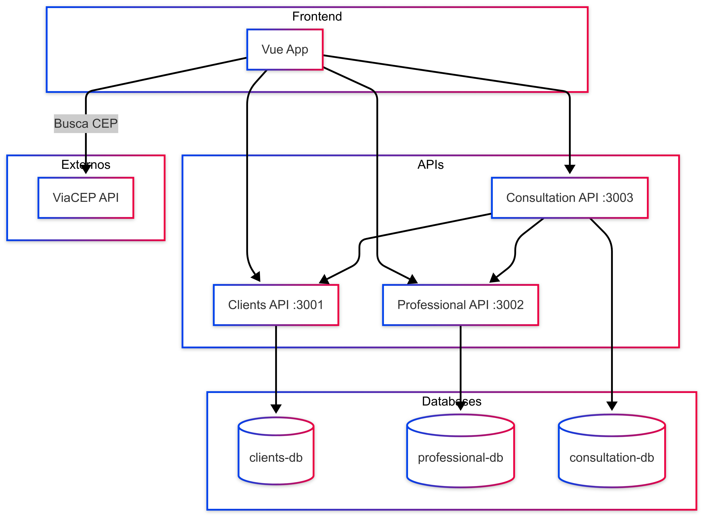

# Sistema de Agendamento de Consultas

Este sistema tem como objetivo centralizar e facilitar o processo de agendamento de consultas, oferecendo funcionalidades completas para o **cadastro de clientes**, **cadastro de profissionais** e o **gerenciamento de consultas**. Através de uma interface web moderna, os usuários podem registrar novos clientes e profissionais da saúde, configurar especialidades, além de agendar, listar e gerenciar consultas de forma integrada. A estrutura do sistema é baseada em microserviços, promovendo uma separação clara entre as responsabilidades e garantindo escalabilidade e manutenibilidade.

## Sumário

1. [Tecnologias Utilizadas](#tecnologias-utilizadas)  
2. [Arquitetura do Projeto](#arquitetura-do-projeto)  
3. [Como Executar](#como-executar)  
4. [Fluxo e Comunicação](#fluxo-e-comunicação)  

---

## Tecnologias Utilizadas

- **[NestJS](https://nestjs.com/)** – APIs backend  
- **[PostgreSQL](https://www.postgresql.org/)** – Banco de dados relacional  
- **[Docker](https://www.docker.com/)** – Containerização e orquestração  
- **[Vue 3](https://vuejs.org/)** – Frontend  
- **[Vite](https://vitejs.dev/)** – Bundler do Vue  
- **[ViaCEP](https://viacep.com.br/)** – API externa para busca de CEP  

---

## Arquitetura do Projeto

Este sistema é composto por:

| Serviço              | Porta | Descrição                              |
|---------------------|-------|------------------------------------------|
| **Clients API**      | 3001  | Gerencia cadastro de clientes            |
| **Professional API** | 3002  | Gerencia cadastro de profissionais       |
| **Consultation API** | 3003  | Gerencia agendamento de consultas        |
| **Frontend Vue**     | 80    | Interface Web integrada com todas as APIs |

### Integrações
- A **Consultation API** depende da **Clients API** e da **Professional API**.
- A integração com a **API ViaCEP** permite preenchimento automático de endereço.
- O **frontend** consome todas as APIs via HTTP.

---

## Fluxo e Comunicação

Abaixo está um diagrama ilustrando como os serviços se comunicam entre si:



---

## Como Executar

> Você pode executar tudo com **Docker Compose**, sem necessidade de instalar dependências localmente.

### 1. Subir os containers

```bash
docker-compose up --build
```

Esse comando irá:
- Subir os bancos de dados PostgreSQL
- Clonar e construir as três APIs NestJS
- Compilar o frontend Vue
- Servir tudo integrado via Nginx e redes Docker

---

### 2. Acessar a aplicação

| Interface             | URL                            |
|----------------------|---------------------------------|
| **Frontend Web**      | [http://localhost](http://localhost)  
| **Clients API**       | [http://localhost:3001](http://localhost:3001)  
| **Professional API**  | [http://localhost:3002](http://localhost:3002)  
| **Consultation API**  | [http://localhost:3003](http://localhost:3003)  

---

### 3. Parar os containers

```bash
docker-compose down
```
